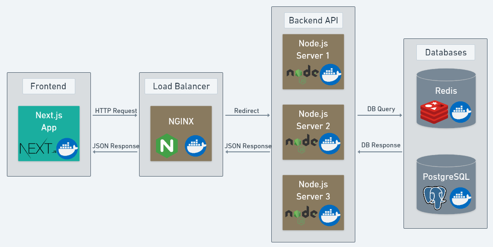
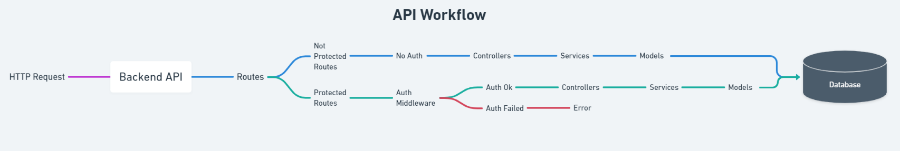

# Find it Back-end

The Backend application of Find It project. \
This application expect a HTTP request from Client Frontend and it returns a JSON with data.

## Technologies

In this application the technologies below was used:

<a href="https://nodejs.org/en/" target="_blank">
   
</a>
<a href="https://expressjs.com/pt-br/" target="_blank">
   
</a>
<a href="https://typeorm.io/#/" target="_blank">
  
</a>
<a href="https://www.postgresql.org/" target="_blank">
  
</a>
<a href="https://redis.io/" target="_blank">
  
</a>
<a href="https://www.nginx.com/" target="_blank">
  
</a>
<a href="https://www.docker.com/" target="_blank">
  
</a>
<a href="https://heroku.com/" target="_blank">
  
</a>
<br></br>





## Setup

Firstly you can clone by using the command below:

```bash
git clone https://github.com/BrunoUemura/findit-backend-node.git
```

Or download the zip file directly from [Github](https://github.com/BrunoUemura/findit-backend-node/archive/refs/heads/master.zip) and unzip it.

After, downloading open the project direcotiry and run the following commands:

### Development environment

_Make sure to check the environment variables_

- To install the dependencies `npm install`
- To run the database migrations `npx sequelize-cli db:migrate`
- To run the project `npm run dev`

### Test environment

_Make sure to check the environment variables_
For testing environment, it is recomended to use docker.

Run the Dockerize Script in bash.

- To run the dockerize script `npm run docker`

### Production environment

_Make sure to check the environment variables_

- To install the dependencies `npm install`
- To run the database migrations `npx sequelize-cli db:migrate`
- To run the project `npm start`

## How it works

In this API we have several endpoints that is used by the frontend application. \
To make HTTP request to the endpoints in this API it is necessary to include `/api` before each route. The following are the routes and basic instructions to use them.

---

### Swagger API Documentation

**Description**: Swagger API documentation. \
**Method**: GET \
**Endpoint**: /api-docs \

---

### Users Endpoint

**Description**: Make a registration (create user). \
**Method**: POST \
**Endpoint**: /api/auth/register \
**Body**:

```json
{
  "name": "Name Lastname",
  "email": "your.email@example.com",
  "password": "your_password"
}
```

---

**Description**: Make a login (authenticate user). \
**Method**: POST \
**Endpoint**: /api/auth/login \
**Body**:

```json
{
  "email": "your.email@example.com",
  "password": "your_password"
}
```

---

**Description**: List all the existing users. \
**Method**: GET \
**Endpoint**: /api/users

---

**Description**: List one user by its ID. \
**Method**: GET \
**Endpoint**: /api/users/<user_id>

---

**Description**: Update user by ID. \
**Method**: PUT \
**Endpoint**: /api/users/<user_id> \
**Authorization**: Bearer Token `eyJhbGciOiJIUzI1NiIs...` \
**Body**:

```json
{
  "name": "Name Lastname",
  "email": "your.email@example.com",
  "location": "City, State",
  "phone": "+55 19 99999-9999",
  "occupation": "Software Developer",
  "about_me": "I am a software engineer with experience in backend using Node.js + Express",
  "user_photo": "https://github.com/BrunoUemura.png"
}
```

---

**Description**: Delete a user by ID. \
**Method**: DELETE \
**Endpoint**: /api/users/<user_id> \
**Authorization**: Bearer Token `eyJhbGciOiJIUzI1NiIs...` \

---

---

### Services Endpoint

**Description**: List all the existing services. \
**Method**: GET \
**Endpoint**: /api/services

---

**Description**: List a service by its ID. \
**Method**: GET \
**Endpoint**: /api/services/<service_id>

---

**Description**: List all the existing services by filter. \
**Method**: GET \
**Endpoint**: /api/services?category=?category=Construction \
**Endpoint**: /api/services?location=?location=Campinas, SP

---

**Description**: Create a service passing the following body (Remember to pass an existing user ID in the body). \
**Method**: POST \
**Endpoint**: /api/services/ \
**Authorization**: Bearer Token `eyJhbGciOiJIUzI1NiIs...` \
**Body**:

```json
{
  "user_id": "2e0313fb-fe0f-4dfb-a3e1-df0692762973",
  "title": "Windows Training",
  "category": "IT",
  "description": "I need someone to teach me how to use windows 11",
  "price": "50",
  "location": "Brooklyn, NY"
}
```

---

**Description**: Update an existing service passing the following body (Remember to pass the service id in URL). \
**Method**: PUT \
**Endpoint**: /api/services/<service_id> \
**Authorization**: Bearer Token `eyJhbGciOiJIUzI1NiIs...` \
**Body**:

```json
{
  "title": "Windows Training",
  "category": "IT",
  "description": "I need someone to teach me how to use windows 11",
  "price": "50",
  "location": "Brooklyn, NY"
}
```

---

**Description**: Delete a service by its ID. \
**Method**: DELETE \
**Endpoint**: /api/services/<service_id> \
**Authorization**: Bearer Token `eyJhbGciOiJIUzI1NiIs...`

---

## Authors

- Bruno Hideki Uemura [linkedin](https://www.linkedin.com/in/bruno-hideki-uemura-918589139/), [Github](https://github.com/BrunoUemura)
- Jose Lacerda Junior [linkedin](https://www.linkedin.com/in/jos%C3%A9-lacerdajr98/), [Github](https://github.com/joselacerdajunior)
